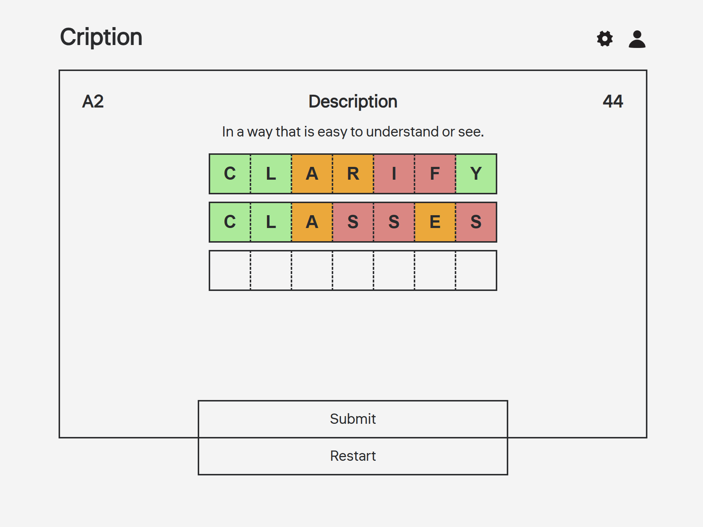

# Cription

Interactive vocabulary training platform built with Node.js, Express, PostgreSQL and Vanilla JS. This project focuses on cognitive recall skills (guessing words by definition) and features levels from A1 to C2, time modes, and user progress tracking.

## Setup Instructions

1. Clone the repository:
```
git clone https://github.com/trenter39/cription.git
cd cription
```

2. Install dependencies via **npm**:
```
npm install
```

3. Create `cription` database in **PostgreSQL**.
```
create database cription;
```

4. Set up the database by running the `criptiondb.sql` schema file.
```
psql -U postgres -d cription < schema.sql
```

5. Configure connection to **PostgreSQL** by creating `.env` file in the root folder. `.env` file must contain fields (example with default values):
```
PORT=8080
DB_HOST=localhost
DB_USER=postgres
DB_PASSWORD=your_password
DB_NAME=cription
DB_PORT=5432
JWT_SECRET=cription_secret
JWT_EXPIRES_IN=1d
```

6. Start the server
```
node app.js
```

Now you can visit website via `http://localhost:8080/`.

